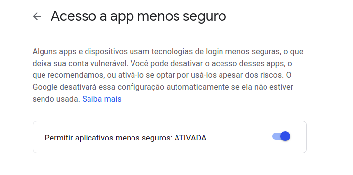

<h1 align="center">
    Geração de Arquivo PDF com NodeJs.
</h1>

## Indice

- [Sobre](#-sobre)
- [Tecnologias utilizadas](#-tecnologias-utilizadas)
- [Rotas de acesso a aplicação](#-rotas-de-acesso-a-aplicação)
- [Como fazer Donwload do projeto](#-como-fazer-download-do-projeto)
- [Configurando Projeto](#-configurando-projeto)
- [Executando Projeto](#-executando-projeto)
- [Envio de E-mail utilizando Gmail](#-envio-de-e-mail-utilizando-gmail)
##  Sobre
O Projeto **Gerar-PDF** consiste em um exemplo de geração de arquivo PDF a partir de páginas Html, neste projeto será possivel acessar uma página com uma lista de contatos e gerar arquivo PDF e enviar o arquivo em anexo via e-mail.
##  Tecnologias utilizadas
O projeto foi desenvolvido com a seguintes tecnologias.
- [NodeJs](https://www.nodejs.org)
- [Vscode](https://www.code.)
- [Express](https://www.npmjs.com/package/express)
- [html-pdf](https://www.npmjs.com/package/html-pdf)
- [dotenv-safe](https://www.npmjs.com/package/dotenv-safe)
- [nodemon](https://www.npmjs.com/package/nodemon)
- [ejs](https://www.npmjs.com/package/ejs)
- [nodemailer](https://www.npmjs.com/package/nodemailer)

## Rotas de acesso a aplicação
Para acesso a aplicação deve ser digitado o endereço.

- http://localhost:3000/ - Acesso a página raiz da aplicação com a lista de contatos estática.
- http://localhost:3000/email - Acessa página para envio do arquivo gerado no projeto via e-mail.
## Como fazer Download do projeto
Para realizar o download do projeto realize os seguintes passos
```bash
# Clonar o repositório para sua máquina
$ git clone https://github.com/ostrowskijr/gerar-pdf.git

# Entrar no Diretório onde o projeto foi clonado
$ cd gerar-pdf

# Abrir o projeto no Vscode ou IDE de sua preferência(Comando abaixo abre o Vscode na pasta do projeto)
$ code .

# Realizar o download das depências do Projetos
$ npm .
```
## Configurando projeto
Para utilizar a rota de envio de e-mail, será necessaŕio criar o arquivo .env na pasta raiz do projeto para configurar dados de acesso a conta de e-mail.

```bash
# No arquivo .env criar os seguintes parâmetros
EMAIL=(Sua conta de E-mail)
SENHA=(Senha do seu E-mail)
# Salvar o arquivo
```
## Executando Projeto
Após a configação do projeto em sua máquina, o mesmo já está pronto para ser utilizar conforme comando de execução abaixo:
```bash
# Finalmento o projeto será executado
$ npm run dev
```
## Envio de E-mail utilizando Gmail
Para utilizar a sua conta no Gmail para teste no projeto, será necessário acessar as configurações de segurança de sua conta e habilitar a opção **Acesso a app menos Seguro**.

